# WTF(What The Fuzz) Example #1

### Target Program

```c++
// test.exe

#define _CRT_SECURE_NO_WARNINGS
#include <stdio.h>
#include <stdlib.h>
#include <string.h>

char buf[0x1000];

void fuzzme(char* buf) {
	char localbuf[0x200] = { 0, };
    if (buf[0] == 'A')
        memcpy(localbuf, buf, strlen(buf)); // ← here is vuln
    else
        memcpy(localbuf, buf, 0x10);

    printf("%s\n", localbuf);
}

int main(int argc, char* argv[]) {
	if (argc < 2) {
		fprintf(stderr, "no input file\n");
		exit(-1);
	}

	FILE* f = fopen(argv[1], "rb");
	fgets(buf, 0x1000, f);
	fuzzme(buf);
    return 0;
}
```


<br>


### Kernel Debugging

- Hyper-v (Guest)

```
// cmd (Administrator)

bcdedit /debug on
bcdedit /dbgsettings net hostip:<gateway IP> port:50039
```

​	→ Key=2rtyhcsg58yv4.2v10whap2a62h.2wo4qedn94xxc.3h13r712v10k5

- Host

```
// cmd (Administrator)

WinDbg –k net:port=50039,Key=<key>

// If cannot, install 'windbg' in Microsoft Store

WinDbgX –k net:port=50039,Key=<key>
```

- Hyper-v (Guest)

```
// cmd (Administrator)

shutdown -r -t 0
```

- Host

```
// WinDbgX

kd> SRV*c:\symbols*http://msdl.microsoft.com/download/symbols
kd> .reload (/f /user)

kd> !gflag +ksl
kd> sxe ld test.exe
kd> g
```

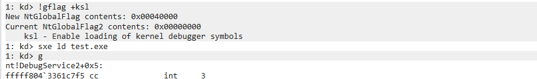

- Hyper-v (Guest)

```
// cmd (Administrator)

.\test.exe .\input.txt
```

- Host

```
// WinDbgX

kd> .sympath+ C:\Users\user\Desktop\fuzzing_project\EMF_Fuzzing\test\x64\Release
kd> .reload

kd> bu test!main
kd> g

kd> bu test!fuzz
kd> g
```

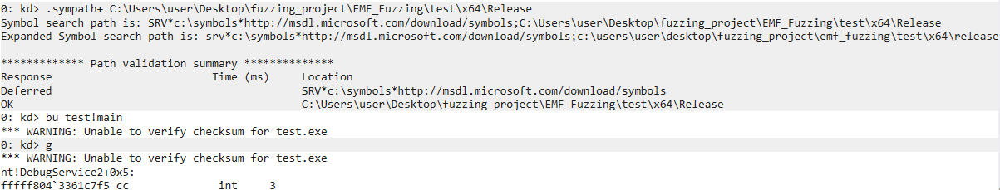

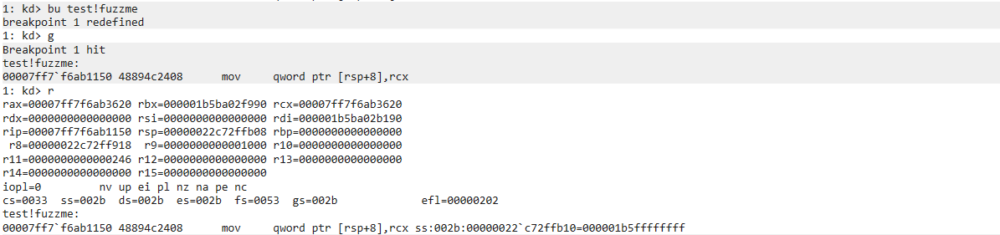

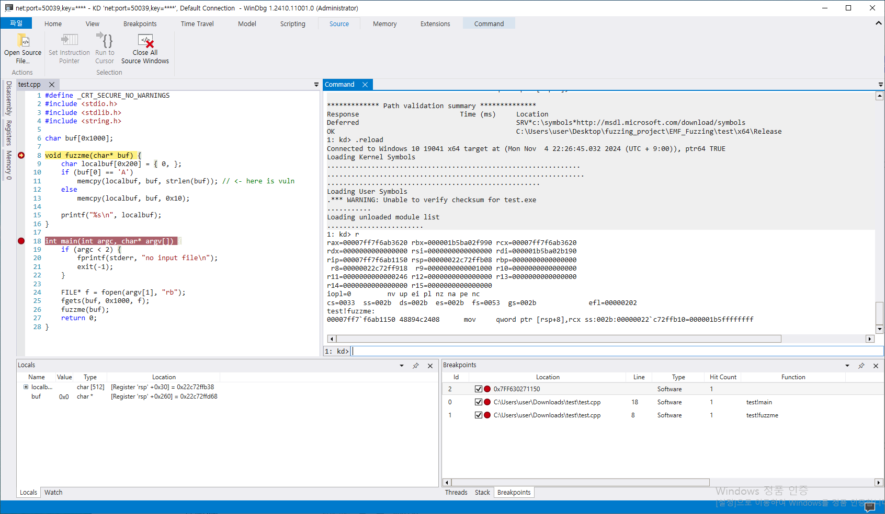

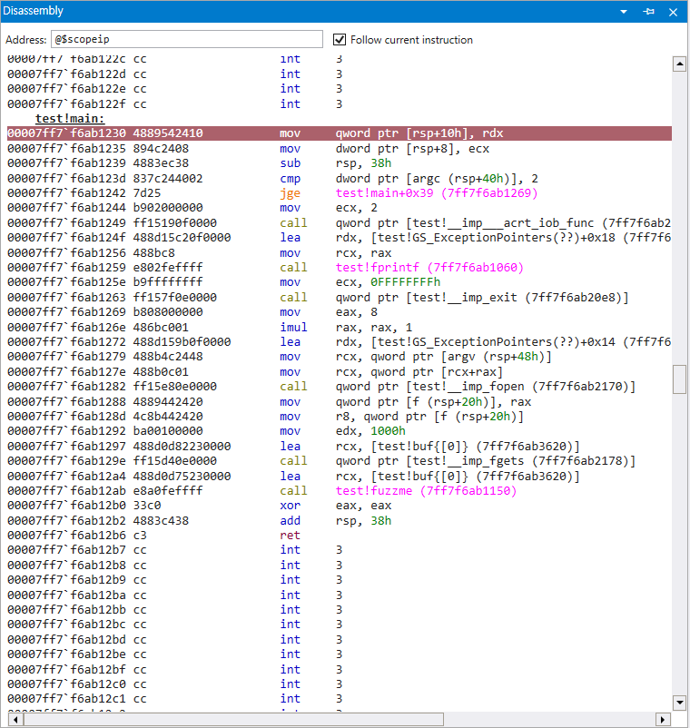

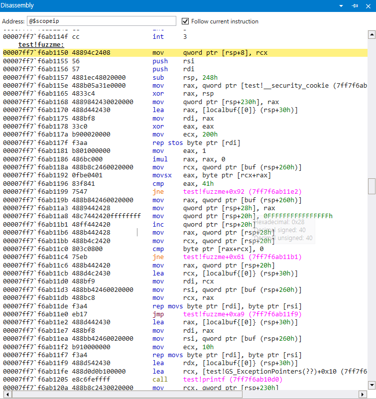

```
// WinDbgX

kd> .scriptload C:\Users\user\Desktop\fuzzing_project\EMF_Fuzzing\bdump\bdump.js
kd> !bdump_full "C:\\Users\\user\\Desktop\\fuzzing_project\\EMF_Fuzzing\\bdump\\state_full"
```

> 1: kd> !bdump_full "C:\Users\user\Desktop\fuzzing_project\EMF_Fuzzing\wtf\bdump\state_full"
> 
> [bdump] creating dir...
> 
> [bdump] saving regs...
> 
> [bdump] register fixups...
> 
> [bdump] don't know how to get mxcsr_mask or fpop, setting mxcsr_mask to 0xffbf and fpop to zero...
> 
> [bdump] don't know how to get avx registers, skipping...
> 
> [bdump] tr.base is not canonical...
> 
> [bdump] old tr.base: 0xdf1000
> 
> [bdump] new tr.base: 0xffffe00000df1000
> 
> [bdump] rip and gs don't match kernel/user, swapping...
> 
> [bdump] rip: 0x7ff7f6ab1150
> 
> [bdump] new gs.base: 0x22c70b8000
> 
> [bdump] new kernel_gs_base: 0xffffe0000de3000
> 
> [bdump] non-zero IRQL in usermode, resetting to zero...
> 
> [bdump] saving mem, get a coffee or have a smoke, this will probably take around 10-15 minutes...
> 
> [bdump] Creating C:\Users\user\Desktop\fuzzing_project\EMF_Fuzzing\wtf\bdump\state_full\mem.dmp - Full memory range dump
> 
> [bdump] 0% written.
> 
> [bdump] 5% written. 21 sec remaining.
> 
> [bdump] 10% written. 19 sec remaining.
> 
> [bdump] 15% written. 18 sec remaining.
> 
> [bdump] 20% written. 18 sec remaining.
> 
> [bdump] 25% written. 17 sec remaining.
> 
> [bdump] 30% written. 16 sec remaining.
> 
> [bdump] 35% written. 15 sec remaining.
> 
> [bdump] 40% written. 14 sec remaining.
> 
> [bdump] 45% written. 14 sec remaining.
> 
> [bdump] 50% written. 13 sec remaining.
> 
> [bdump] 55% written. 12 sec remaining.
> 
> [bdump] 60% written. 11 sec remaining.
> 
> [bdump] 65% written. 10 sec remaining.
> 
> [bdump] 70% written. 9 sec remaining.
> 
> [bdump] 75% written. 8 sec remaining.
> 
> [bdump] 80% written. 7 sec remaining.
> 
> [bdump] 85% written. 6 sec remaining.
> 
> [bdump] 90% written. 5 sec remaining.
> 
> [bdump] 95% written. 4 sec remaining.
> 
> [bdump] 100% written.
> 
> [bdump] Wrote 2.7 GB in 21 sec.
> 
> [bdump] The average transfer rate was 127.5 MB/s.
> 
> [bdump] Dump successfully written
> 
> kd> !bdump_full("C:\Users\user\Desktop\fuzzing_project\EMF_Fuzzing\wtf\bdump\state_full")


<br>


### Fuzzer Code

```C++
#include "backend.h"
#include "targets.h"
#include <fmt/format.h>
#include "crash_detection_umode.h"
​
namespace fs = std::filesystem;
​
namespace Test_wtf {
​
constexpr bool LoggingOn = false;
​
template <typename... Args_t>
void DebugPrint(const char *Format, const Args_t &...args) {
  if constexpr (LoggingOn) {
    fmt::print("Test WTF : ");
    fmt::print(fmt::runtime(Format), args...);
  }
}
​
bool InsertTestcase(const uint8_t *Buffer, const size_t BufferSize) {
  
  const Gva_t buf = Gva_t(g_Backend->Rcx());
  if (!g_Backend->VirtWriteDirty(buf, Buffer, BufferSize)){
        DebugPrint("VirtWriteDirty failed\n");
        return false;
  }
  
​
  return true;
}
​
bool Init(const Options_t &Opts, const CpuState_t &) {
  
  if (!g_Backend->SetBreakpoint(Gva_t(0x007ff6f327121d), [](Backend_t *Backend) {
        DebugPrint("fuzzme finish\n");
        Backend->Stop(Ok_t());
      })) {
    DebugPrint("Failed to SetBreakpoint main+0x9d\n");
    return false;
  }
​
  SetupUsermodeCrashDetectionHooks();
​
  return true;
}
​
//
// Register the target.
//
​
Target_t Test_wtf("test_wtf", Init, InsertTestcase);
​
}
```

 

<br>


### Run Fuzzer

- Server

```
// cmd (Administrator)

..\..\src\build\RelWithDebInfo\wtf.exe master --max_len=2048 --runs=1000000 --target . --name test_wtf
```

- Client

```
// cmd (Administrator)

..\..\src\build\RelWithDebInfo\wtf.exe fuzz --backend=bochscpu --limit 100000 --target . --name test_wtf
```


<br>


### Result

- Coverage 파일 생성

 

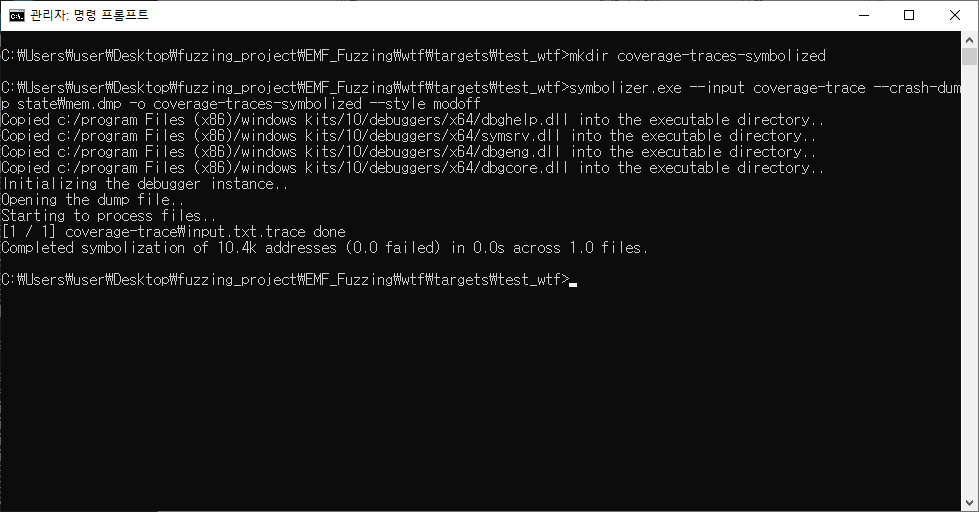
	 → IDA에서 coverage file 로드해서 함수 어느 부분까지 실행되는지 확인

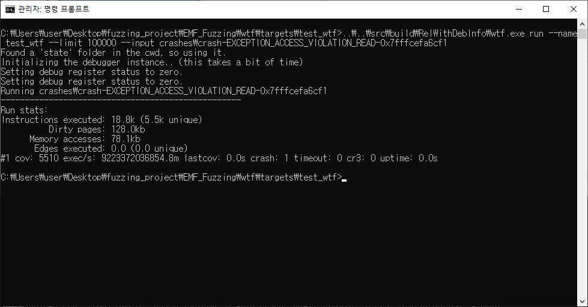

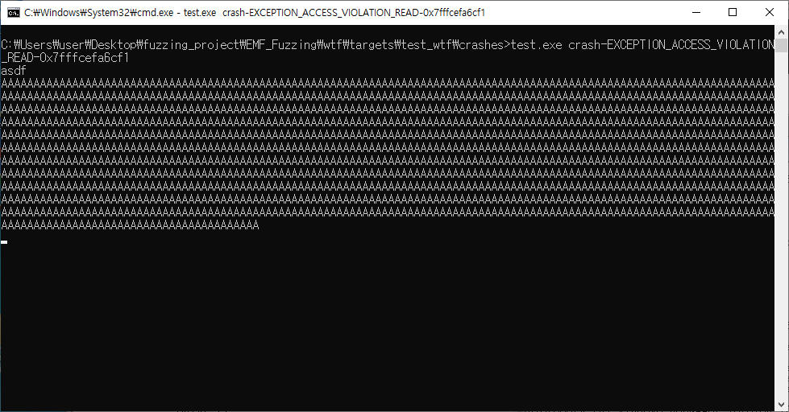

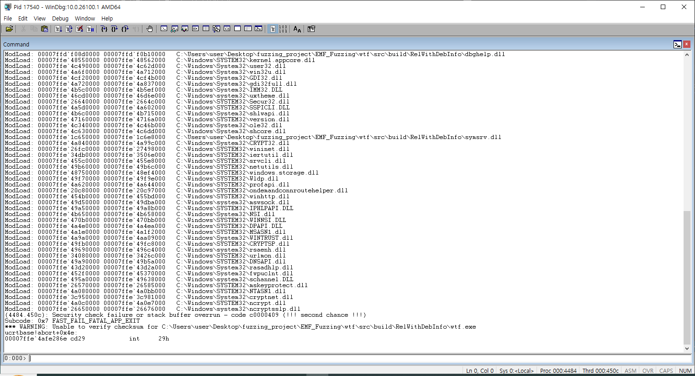

​	=> crash 발생

<br>


### Trouble Shooting

1) `There is a fpst register that isn't set to 0xInfinity which should not happen, bailing.LoadCpuStateFromJSON failed, no take off today.`      
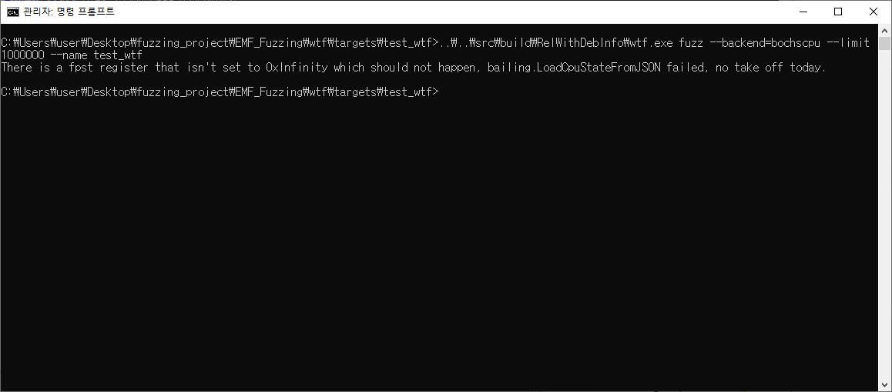	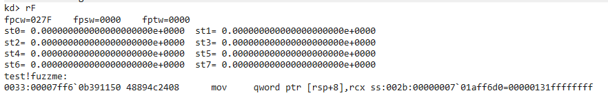

```
// bdump.js

regs.fpst = Array();
regs.fpst[0] = Fprs.st0;
regs.fpst[1] = Fprs.st1;
regs.fpst[2] = Fprs.st2;
regs.fpst[3] = Fprs.st3;
regs.fpst[4] = Fprs.st4;
regs.fpst[5] = Fprs.st5;
regs.fpst[6] = Fprs.st6;
regs.fpst[7] = Fprs.st7;
```

- Solution

```
// wtf.sln - utils.cc

// This is what `bdump` outputs and what 'old' wtf used, so let's keep that
// working.
//

if (Json["fpst"][Idx].is_string()) {
  const std::string &Value = Json["fpst"][Idx].get<std::string>();
  const bool Infinity = Value.find("Infinity") != Value.npos;
  if (!Infinity) {
    fmt::print("There is a fpst register that isn't set to 0xInfinity "
                 "which should not happen, bailing.");
    return false;
  }

  BdumpGenerated = true;
} else {
  Fraction = std::strtoull(
      Json["fpst"][Idx]["fraction"].get<std::string>().c_str(), nullptr, 0);
  Exp = uint16_t(std::strtoull(
      Json["fpst"][Idx]["exp"].get<std::string>().c_str(), nullptr, 0));
}

CpuState.Fpst[Idx].fraction = Fraction.value_or(0);
CpuState.Fpst[Idx].exp = Exp.value_or(0);
```

​	→ 위 코드 주석 처리


<br>


2) `Error: Error: Unexpected internal error [at bdump (line 128 col 22)]`

​	→ bdump가 정상적으로 수행되지 않음

​	=> symbol이 제대로 로드되지 않아서 발생한 문제로 추정

- symbol reload 실행

```
// WinDbg

kd> !sym noisy
noisy mode - symbol prompts on

kd> .reload /f /user
Loading User Symbols
...

kd> !process 0 0 test.exe

kd> .reload /f /user
Loading User Symbols
...
```

- test.exe 실행

```
// WinDbg

kd> !process 0 0 test.exe
kd> g

kd> !process 0 0 test.exe
PROCESS ffffc60c7351e080
    SessionId: 2  Cid: 23ec    Peb: 7888b22000  ParentCid: 19cc
    DirBase: 9c75c000  ObjectTable: ffffd68ad8c06c40  HandleCount:  52.
    Image: test.exe

kd> .process /i ffffc60c7351e080
You need to continue execution (press 'g' <enter>) for the context
to be switched. When the debugger breaks in again, you will be in
the new process context.
kd> g
Break instruction exception - code 80000003 (first chance)
nt!DbgBreakPointWithStatus:
fffff800`144257a0 cc              int     3

kd> .reload /f /user

kd> bp test!main
kd> g

kd> bp test!fuzzme
kd> g
```

- bdump 실행

```
kd> .scriptload C:\Users\user\Desktop\fuzzing_project\EMF_Fuzzing\bdump\bdump.js
[bdump] Usage: !bdump "C:\\path\\to\\dump"
[bdump] Usage: !bdump_full "C:\\path\\to\\dump"
[bdump] Usage: !bdump_active_kernel "C:\\path\\to\\dump"
[bdump] This will create a dump directory and fill it with a memory and register files
[bdump] NOTE: you must include the quotes and escape the backslashes!
JavaScript script successfully loaded from 'C:\Users\user\Desktop\fuzzing_project\EMF_Fuzzing\wtf\bdump\bdump.js'
kd> !bdump_full "C:\\Users\\user\\Desktop\\fuzzing_project\\EMF_Fuzzing\\bdump\\state_full"
...
[bdump] Dump successfully written
[bdump] done!
@$bdump_full("C:\\Users\\user\\Desktop\\fuzzing_project\\EMF_Fuzzing\\wtf\\bdump\\state_full")
```


<br>


3. Context switch가 발생하여 함수가 정상적으로 종료되지 않음	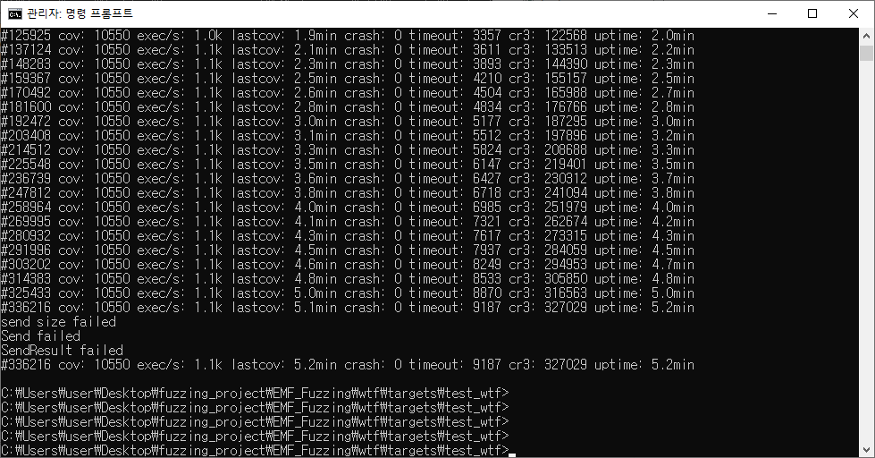

- Visual Studio에서 `/GS` 옵션 제거하고 build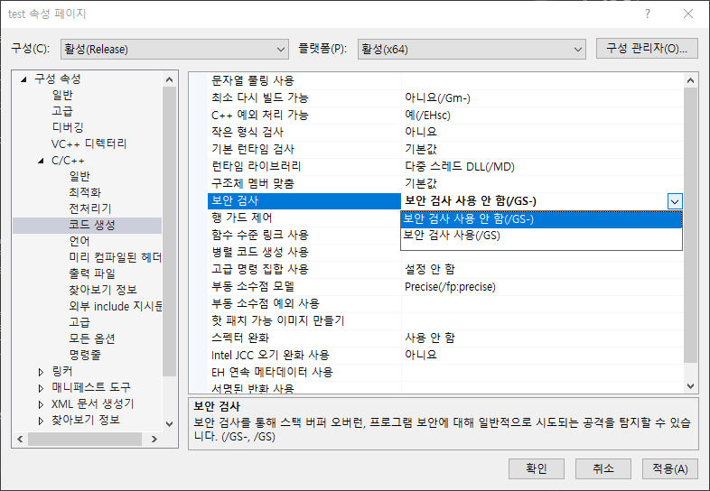
  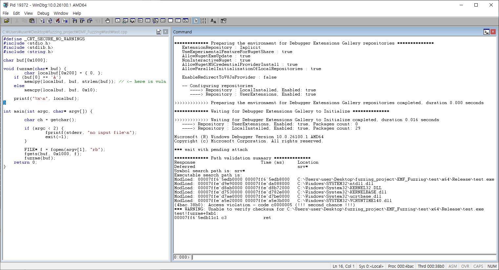

-  `0x007ff607ac12b5` : `fuzzme` 함수 호출	

​		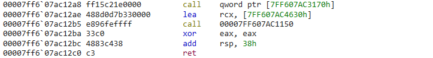

-  `0x007ff607ac12c0` : `fuzzme` 함수 호출 이후 `main` 함수의 `ret` 구간 주소 지정

​		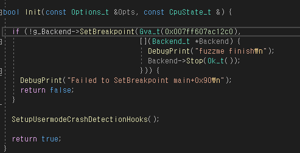

- Breakpoint가 걸리는 주소를 `fuzzme` 함수 호출 이후의 주소로 지정
  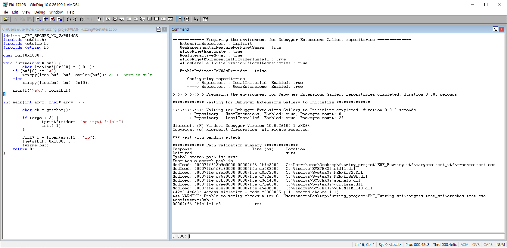


### Reference

- [https://chp747.tistory.com/419](https://chp747.tistory.com/419)
- [https://minseosavestheworld.tistory.com/200](https://minseosavestheworld.tistory.com/200)
